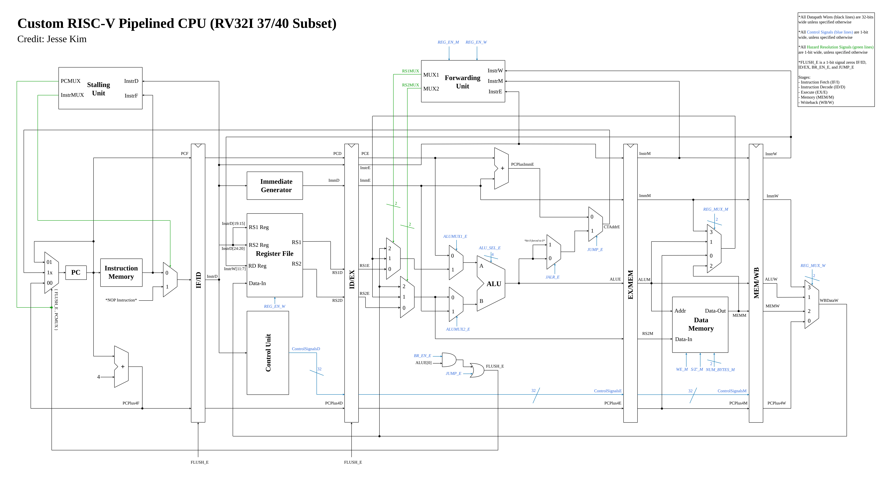
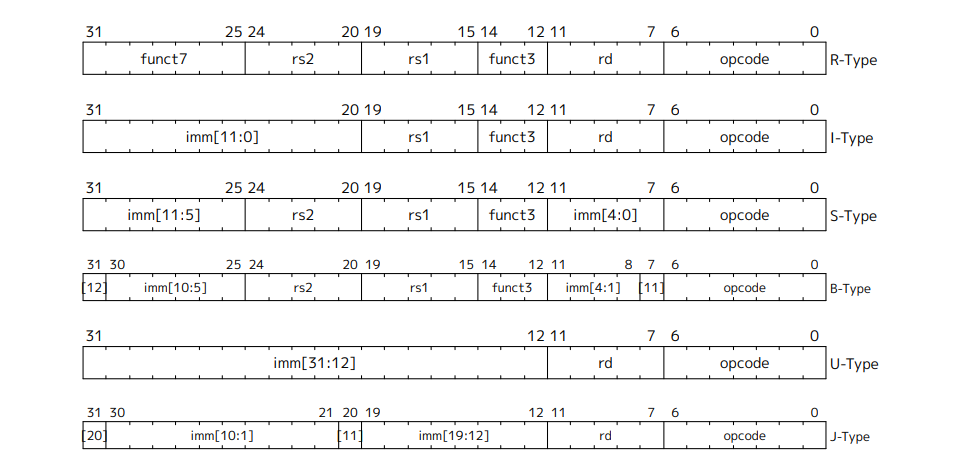
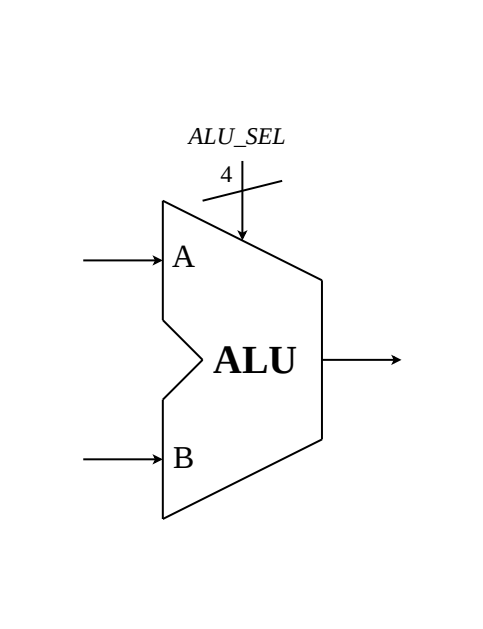
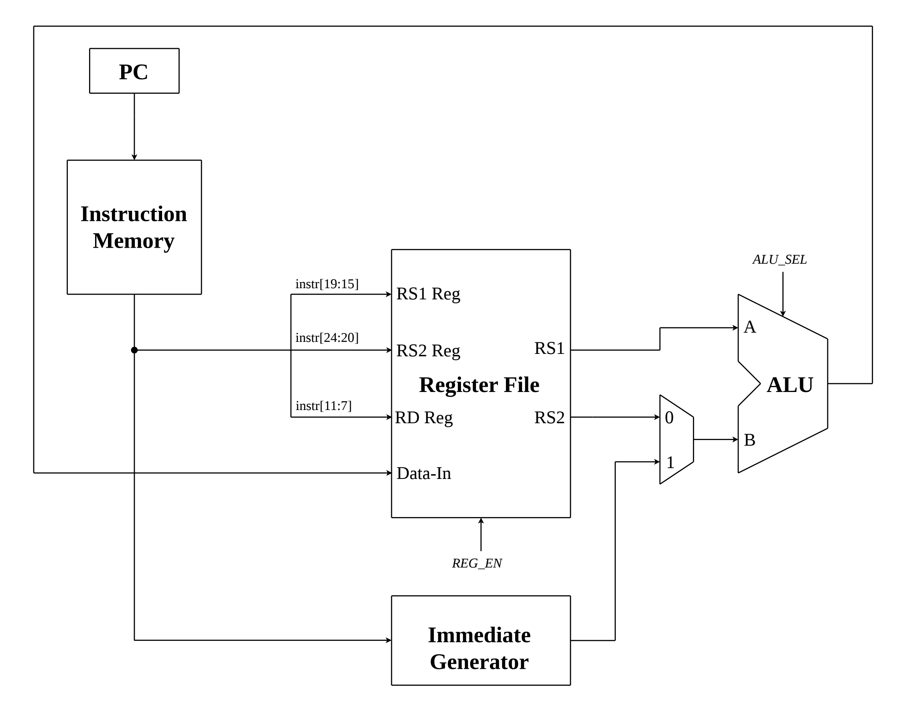
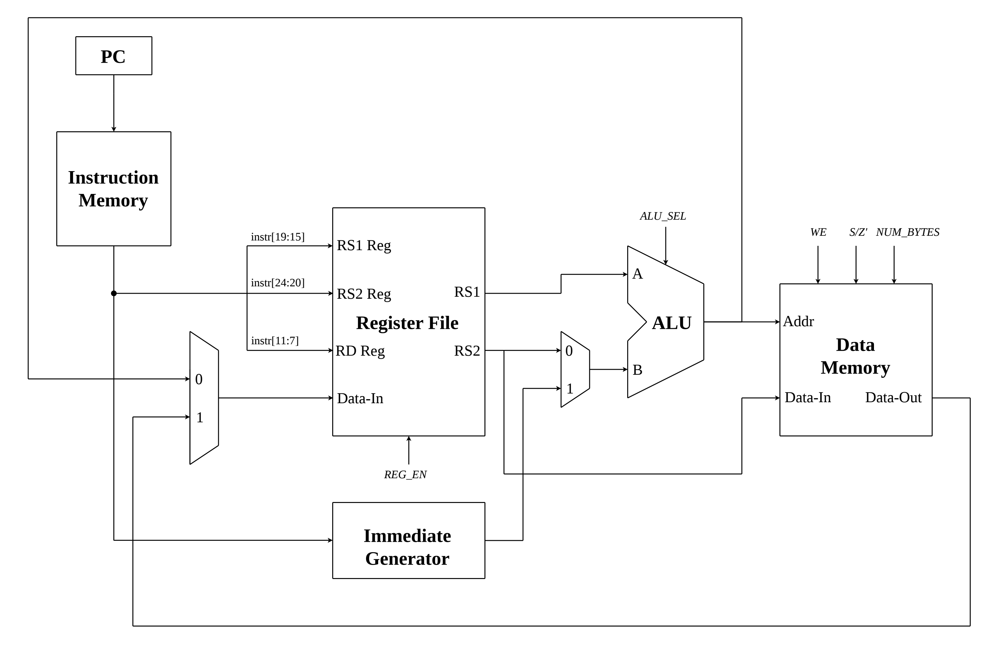
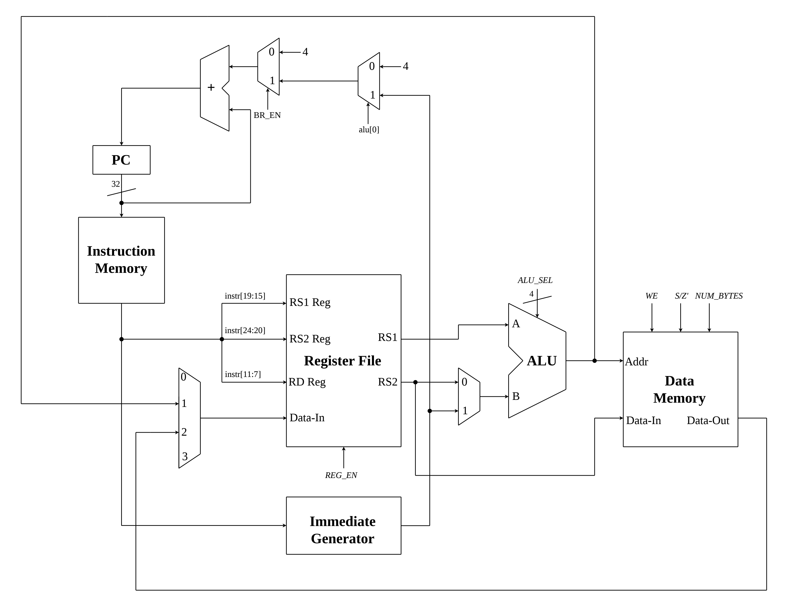
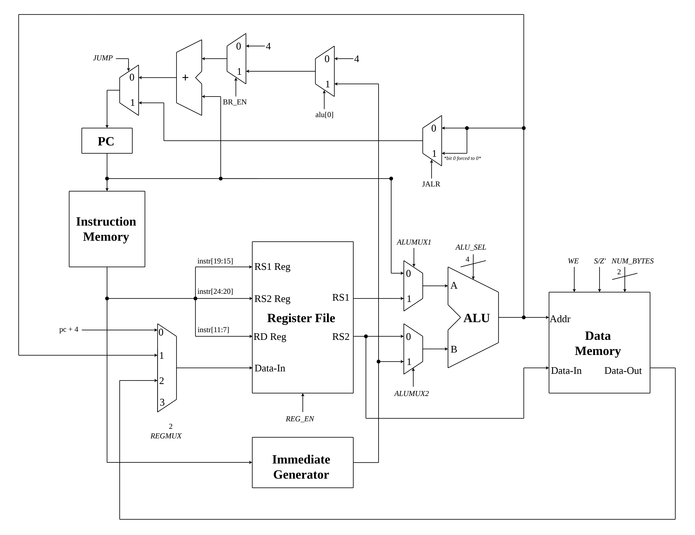
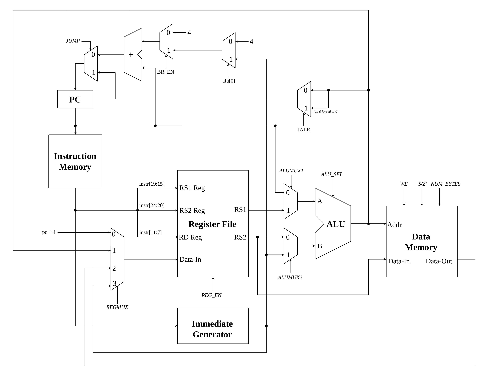
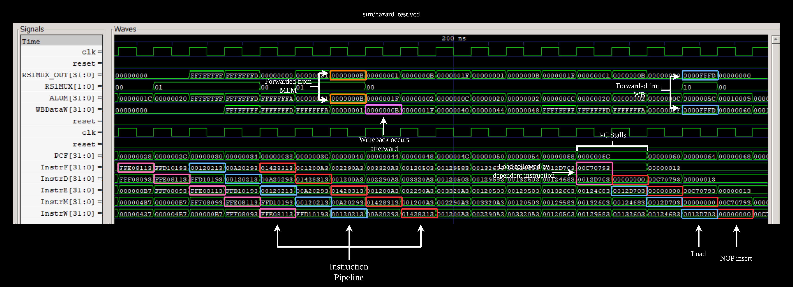

## Table of Contents
- [Overview](#overview)
- [Building a Single-Cycle CPU](#building-a-single-cycle-cpu)
  - [RV32I ISA](#rv32i-isa)
  - [Register-Register Operation](#register-register-operation)
  - [Register-Immediate Operation](#register-immediate-operation)
  - [Loads and Stores](#loads-and-stores)
  - [Branch](#branch)
  - [Jump](#jump)
  - [Other](#other)
  - [Control Unit Design](#control-unit-design)
- [Pipelining a CPU](#pipelining-a-cpu)
  - [5-Stage Pipeline](#5-stage-pipeline)
  - [Pipeline Hazards and Resolution Techniques](#pipeline-hazards-and-resolution-techniques)
  - [Verification](#verification)
- [Future Plans](#future-plans)

## Overview

The following documentation fully describes this Central Processing Unit (CPU) design, beginning with an explanation of the approach I took to design my own custom single-cycle CPU for RISC-V, then Pipelining this CPU and implementing full hazard resolution. 

This CPU is a 5-stage (IF/ID/EX/MEM/WB) Pipelined CPU . It uses forwarding, pipeline stalling, and register file write through for a complete hazard resolution. Verification of the CPU's functionality was confirmed using hand-written isolated module-level testbenches and hand-assembled machine code programs with GTKWave analysis.

## Building a Single-Cycle CPU

### RV32I ISA
The base RV32I ISA consists of 40 instructions. This implementation was for a 37-instruction subset, which excluded the `FENCE`, `EBREAK`, and `ECALL` instructions. For hardware implementation, the instructions can be broken into the following groups:

- Register-Register Arithemetic and Logical Operations
  - `ADD`, `SUB`, `XOR`, etc.
- Register-Immediate Arithmetic and Logical Operations
  - `ADDI`, `XORI`, etc.
- Loads
  - `LW`, `LH`, `LBU`, etc.
- Stores
  - `SB`, `SH`, and `SW`
- Conditional Branches
  - `BEQ`, `BGE`, etc.
- Unconditional Jumps
  - `JAL` and `JALR`
- Individual Instructions that don't fall under previous groups
  - `LUI`
  - `AUIPC`

A full table is shown below:
| Group | Instruction |
|------|------|
| Register-Register Operations | `ADD` `SUB` `XOR` `OR` `AND` `SLL` `SRL` `SRA` `SLT` `SLTU` |
| Register-Immediate Operations | `ADDI` `XORI` `ORI` `ANDI` `SLLI` `SRLI` `SRAI` `SLTI` `SLTIU` |
| Loads | `LB` `LH` `LW` `LBU` `LHU` |
| Stores | `SB` `SH` `SW` |
| Conditional Branches | `BEQ` `BNE` `BLT` `BGE` `BLTU` `BGEU` |
| Unconditional Jumps | `JAL` `JALR` |
| Other | `LUI` `AUIPC` |

Each of the instructions above fall under one of six instruction formats (R, I, S, B, U, J) which are show below:

*Credit: The RISC-V Instruction Set Manual, Volume I: Unprivileged Architecture*

There are few key observations that are helpful for implementation. Firstly, the destination register (rd), source register 1 (rs1), source register 2 (rs2), opcode, funct3, and funct7 are always located in the same place regardless of format. Additionally, the immediate value generated can be completely determined by what instructon format is used. Finally, all instructions with the same opcode will use the same instruction format, meaning the instruction format can be completely determined using only the opcode.

A RISC-V Card is used to describe the key characteristics of each instruction:
| Inst | Name | FMT | Opcode | funct3 | funct7 |
|------|------|-----|--------|--------|--------|
| `ADD` | ADD | R | 0110011 | 0x0 | 0x00 |
| `SUB` | SUB | R | 0110011 | 0x0 | 0x20 |
| `XOR` | XOR | R | 0110011 | 0x4 | 0x00 |
| `OR` | OR | R | 0110011 | 0x6 | 0x00 |
| `AND` | AND | R | 0110011 | 0x7 | 0x00 |
| `SLL` | Shift Left Logical | R | 0110011 | 0x1 | 0x00 |
| `SRL` | Shift Right Logical | R | 0110011 | 0x5 | 0x00 |
| `SRA` | Shift Right Arith* | R | 0110011 | 0x5 | 0x20 |
| `SLT` | Set Less Than | R | 0110011 | 0x2 | 0x00 |
| `SLTU` | Set Less Than (U) | R | 0110011 | 0x3 | 0x00 |
| `ADDI` | ADD Immediate | I | 0010011 | 0x0 | |
| `XORI` | XOR Immediate | I | 0010011 | 0x4 | |
| `ORI` | OR Immediate | I | 0010011 | 0x6 | |
| `ANDI` | AND Immediate | I | 0010011 | 0x7 | |
| `SLLI` | Shift Left Logical Imm | I | 0010011 | 0x1 | imm[5:11]=0x00 |
| `SRLI` | Shift Right Logical Imm | I | 0010011 | 0x5 | imm[5:11]=0x00 |
| `SRAI` | Shift Right Arith Imm | I | 0010011 | 0x5 | imm[5:11]=0x20 |
| `SLTI` | Set Less Than Imm | I | 0010011 | 0x2 | |
| `SLTIU` | Set Less Than Imm (U) | I | 0010011 | 0x3 | |
| `LB` | Load Byte | I | 0000011 | 0x0 | |
| `LH` | Load Half | I | 0000011 | 0x1 | |
| `LW` | Load Word | I | 0000011 | 0x2 | |
| `LBU` | Load Byte (U) | I | 0000011 | 0x4 | |
| `LHU` | Load Half (U) | I | 0000011 | 0x5 | |
| `SB` | Store Byte | S | 0100011 | 0x0 | |
| `SH` | Store Half | S | 0100011 | 0x1 | |
| `SW` | Store Word | S | 0100011 | 0x2 | |
| `BEQ` | Branch == | B | 1100011 | 0x0 | |
| `BNE` | Branch != | B | 1100011 | 0x1 | |
| `BLT` | Branch < | B | 1100011 | 0x4 | |
| `BGE` | Branch >= | B | 1100011 | 0x5 | |
| `BLTU` | Branch < (U) | B | 1100011 | 0x6 | |
| `BGEU` | Branch >= (U) | B | 1100011 | 0x7 | |
| `JAL` | Jump And Link | J | 1101111 | | |
| `JALR` | Jump And Link Reg | I | 1100111 | 0x0 | |
| `LUI` | Load Upper Imm | U | 0110111 | | |
| `AUIPC` | Add Upper Imm to PC | U | 0010111 | | |

### Register-Register Operation
The most logical place to start in my view is with Register-Register Operations (RRO). In this group of instructions some arithmetic or logical operation is performed on the values from two source registers (rs1 and rs2), and the result is stored in a destination register (rd). There are many different types of RRO that are described by the RISC-V Card table above. From this description it is already clear what the majority of components needed are.

Firstly, we need some sort of component to compute these operations. An Arithmetic Logic Unit (ALU) performs an operation on two 32-bit input values, and has a corresponding 32-bit output. Select bits are also fed in as an input which describe which operation needs to performed.

| ALU_SEL | Operation |
|-------------|-----------|
| `0000` | ADD: `a + b` |
| `0001` | SUB: `a - b` |
| `0010` | XOR: `a ^ b` |
| `0011` | OR: `a \| b` |
| `0100` | AND: `a & b` |
| `0101` | SLL: `a << b[4:0]` |
| `0110` | SRL: `a >> b[4:0]` |
| `0111` | SRA: `$signed(a) >>> b[4:0]` |
| `1000` | SLT: `($signed(a) < $signed(b)) ? 1 : 0` |
| `1001` | SLTU: `($unsigned(a) < $unsigned(b)) ? 1 : 0` |

The next thing we will need is a Register File. This will contain 32 general purpose registers with 32-bit addressability (register x0 is forced to 0). The Register File allows for 1 sychronous write, and 2 asychronous reads per clock cycle. Therefore, there are 4 inputs, the first and second read address, the write address, and the write data. It also has a REG_EN input, which functions as a write enable (WE).

Notice how since the instruction formats fix the positions of rs1, rs2, and rd, we can directly wire these from the instruction. Addtionally, we will need some way to store instructions, and a way to access these instructions. This is where the Program Counter (PC) and Instruction Memory come in. The Instruction Memory holds the programs, and the PC stores the address of the current instruction. Instruction Memory has 8-bit or byte addressability, so each 32-bit instruction must align on a 4-byte boundary, and be spread across instructions (my implementation uses Big Endian).

### Register-Immediate Operation
All Register-Immediate Operations (RIO) can be done using the same ALU that we built for the RRO. We simply need to replace the rs2 input with an immediate value. We also need to generate an immediate value based on the instruction format. The logical solution is to use a multiplexer (mux).

### Loads and Stores
Both Load and Store instructions require roughly similar hardware additions to be function. The main component is a Data Memory. One again, both Instruction and Data Memory have 8-bit addressability, but RISC-V has a 32-bit word size, meaning we must make some sort of decision about endianess. For both memories I chose to implement Big Endian.

According to the RISC-V Unprivileged Specification, "The effective address is obtained by adding register rs1 to the signextended 12-bit offset. Loads copy a value from memory to register rd. Stores copy the value in register rs2 to memory"

From this description, the hardware interpretation is straightforward.

### Branch
Conditional Branches alter the PC address based upon conditions relating rs1 and rs2. The target address is obtained by adding the immeditate value generated to the current program counter. For my implementation, I decided to check the conditions using the ALU, and then creating a seperate dedicated `PC += imm` adder by instantiating another ALU and wiring the select bits to `4'b0000`. Many of these conditions are not possible to check using our current ALU implementation, so an extendtion has to be made:
| ALU Control | Operation |
|-------------|-----------|
| `1000` | BLT: `($signed(rs1) < $signed(rs2)) ? 1 : 0` |
| `1001` | BLTU: `($unsigned(rs1) < $unsigned(rs2)) ? 1 : 0` |
| `1010` | BEQ: `(rs1 == rs2) ? 1 : 0` |
| `1011` | BNE: `(rs1 != rs2) ? 1 : 0` |
| `1100` | BGE: `($signed(rs1) >= $signed(rs2)) ? 1 : 0` |
| `1101` | BGEU: `($unsigned(rs1) >= $unsigned(rs2)) ? 1 : 0` |

The datapath then takes the ALU output's least significant bit `ALU[0]` and wires this to the select bit of a mux to control whether or not a branch is taken. As described before, instructions lie on 4-byte boundaries. Therefore, on non-control transfer instructions (branches and jumps) PC increments by 4.

### Jump
There are two different types of unconditional jump instructions, `JAL` (Jump and Link) and `JALR` (Jump and Link Reg). `JAL` calculates the target address by adding the generated immediate value to the address of the instruction. `JALR` calculates the target address by adding the generated immediate value to rs1, then setting the least significant bit to 0. Both jump instructions store `PC + 4`.

Since we have to compute `PC + 4` in addition to the target address, I made the choice to compute the target address using the ALU for both jump instructions, contrary to the branch instruction design which uses a seperate adder. 

### Other
There are two instructions that don't fall under the previous groups (`AUIPC` and `LUI`), however hardware implementation is relatively trivial. `LUI` simply stores a generated immediate value to rd, and `AUIPC` adds an immediate value to PC before storing in RD. Implementation of `AUIPC` does not require any additonal hardware. `LUI` simply requires an additonal MUX input for the Register File. 

### Control Unit Design
The final component is a Control Unit. Based on the given instruction, the Control Unit needs to output datapath control signals which control data movement throughout the CPU, executing the correct instruction. The control unit is hardwired, meaning the outputs are a direction function of inputs, as opposed to a microprogrammed control unit design which fetches simpler states to output signals 

The Control Unit determines all datapath control signals using only the opcode, funct3, and funct7.

Below is the complete single-cycle datapath:
-> .png)

## Pipelining a CPU
One important drawback of the single-cycle CPU is that every single instruction is require to complete in a singular clock cycle. This means that you are bottlenecked by your slowest instruction.

### 5-stage Pipeline
The different "steps" described above are classified as the following stages:
- Instruction Fetch (IF)
- Instruction Decode (ID)
- Execute (EX)
- Memory (MEM)
- Writeback (WB)

By spreading instructions across these 5 stages and running them all at once, we can achieve a maximum speedup of 5x. However, this number is almost never true since not all instructions require every stage, for example, Register-Register Operations are essentially doing nothing in the MEM stage. Additionally, jumps, branches, and specific hazards will also reduce speed, as I will discuss later in this document. 

To implement this pipeline, intermediate registers IF/ID, ID/EX, etc. are place inbetween stages, and all data that passes through components in different stages are now stored in these intermediate registers each clock cycle. This allows the information from each stage to relate to a different instruction, allowing for the pipeline. 

One thing to note is that your pipeline is constantly fetch the next instruction at `PC + 4`, however, if you are branching or jumping, `PC+4` is not always the next instruction to be executed. Therefore, a flush mechanic needs to be implemented. 

In my single-cycle CPU, I found that the earliest a branch/flush can be determined is in the EX state, meaning the IF and ID state would potentially have improper instructions loaded. Therefore, the IF/ID and ID/EX registers need a flush input, which resets all data stored in them whenever a branch or jump is taken. 

Modern CPUs have advanced branch prediction to limit flushing. However, for this implementation I opted to go for a simpler design that simply predicts that a branch/jump is not taken, filling up the pipeline with potentially improper instructions, and then flushing those register if the branch happens to be taken. This does mean that every time a jump is taken the pipeline is guaranteed to fill up with improper instruction, however I opted for this design to maintain simplicity.

The pipelined CPU described above is shown below:
-> .png)

### Pipeline Hazards and Resolution Techniques
The 5-stage Pipeline design also presents potential errors. For example given the following program:

`ADD x1, x3, x5`

`ADD x2, x1, x4`

Notice how the second `ADD` instruction uses register `x1`, which is the rd for the previous `ADD` instruction. However, by the time the second instruction is the EX stage, where it performs a computation using x1, the previous instruction is only at the MEM stage, meaning the new computed `x1` value has yet to be written back into the register file. This is an example of a hazard.

For this pipeline design, there are multiple hazards. Firstly, hazards like the example above, where the value need in the EX stage has been computed but is in the MEM stage. This happens when the dependent instruction is seperated from the root instruction by 1.

There is another hazard similar to this one, where the computed value is in the WB stage. This happens when the dependent instruction is seperated from the root instruction by 2. 

The two hazards described can be solve using forwarding, where the computed values from the MEM and WB stage are inserted into the EX when a Forwarding Unit detects that either rs1 or rs2 match the rd from the MEM and WB stage. 

Another error can happen if a write and read to the same register in the Register File are done at the same time, but the read happens first. This will create a hazard when the dependent instruction is seperated from the root instruction by 3. We can solve this hazard by forcing the write to happen first when this scenario occurs, called write-through.

Finally, the last hazard occurs under the following scenario:

`lhu x14, 1(x5)`

`addi x15, x14, 12`

In this case a load instruction stores a value into `x14`, and the instruction directly after uses that `x14` value. This is an important distinction to previous errors. Since the computed `x14` value will only be avaliable once the MEM stage is completed, if these instructions go through the pipeline consecutively, the ADDI instruction will require the `x14` value in the EX stage, before the register value is obtained. 

This means we need at least one instruction between these two that does nothing for forwarding to be applicable. In this scenario, a Stalling Unit, will detect this hazard, freezing the PC and inserting an NOP instruction into the pipeline for one clock cycle while allowing the load instruction to continue through the pipeline. This will create a "bubble" or empty instruction between the two such that forwarding can now be applied. 

The final pipeline with full hazard resolution is shown below:

### Verification
As mentioned earlier, verification of CPU functionality was determined using isolated module-level testbenches and machine code programs. Certain hazard detection techniques were also verified via wave analysis.

Below is an analysis of hazard resolution. 

